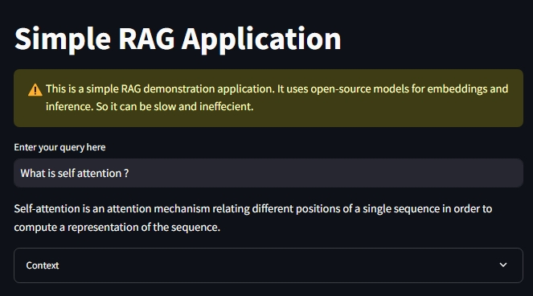

<h1 align="center">SimpleRAG</h1>

<p align="center">
  
</p>

## Overview

This is a simple application to demonstrate **Retrieval-Augmented Generation (RAG)**. It creates a vector database to store the embeddings of the documents and uses a Large Language Model (LLM) for inference. Everything used in this project is open-source.

## Features

- **Vector Database**: Efficiently stores document embeddings.
- **Inference with LLM**: Utilizes Llama3-8b-8192 for generating responses.
- **Open-Source**: Built with freely available tools and models.

## Key Technologies Used

- **Embeddings**: [Craig/paraphrase-MiniLM-L6-v2](https://huggingface.co/Craig/paraphrase-MiniLM-L6-v2)
- **Inference Model**: [Llama3-8b-8192](https://huggingface.co/models/llama3-8b-8192)

## Deployment

The project is deployed at [Hugging Face Spaces](https://huggingface.co/spaces/RohanSardar/simpleRAG).

## Installation

Follow these steps to install the repository and its dependencies:

1. Clone the repository:

   ```
   git clone https://github.com/RohanSardar/SimpleRAG.git
   cd SimpleRAG
2. Create and activate a virtual environment (optional but recommended):
   
   ```
   python3 -m venv venv
   source venv/bin/activate  # On Windows use `venv\Scripts\activate`
4. Install the required dependencies:

   ```
   pip install -r requirements.txt
## APIs

You need to create a .env file and save your Hugging Face API and Groq API there:

  ```
  HF_TOKEN=<your_api>
  GROQ_API_KEY=<your_api>
  ```
## Usage

Place your PDFs under `documents` folder, those files will be converted into embeddings during execution:

  ```
python main.py
